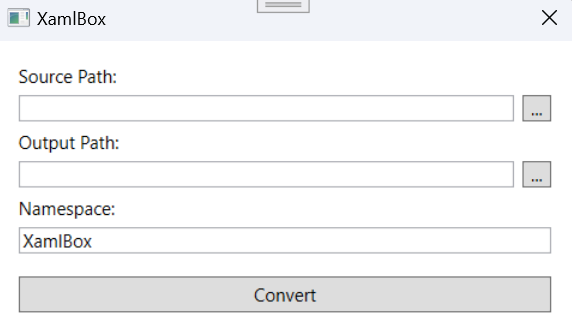

# XamlBox

XamlBox is a .NET based app for converting XAML icons to viewbox classes.

## Installation

The easiest way to build the application is through Visual Studio. Open the project and simply make a build for release.
Also, you can download the built version using this [link](https://github.com/techerfan/XamlBox/releases/download/v1.0.0/net8.0-windows7.0.zip) but you might face some compatibility issues.

## Usage

First, you need to specify a path where all your XAML icons are. Then a path for output viewboxes must be specified. All directories inside the source directory will be created recursively inside the output path too. 

In case that you want to use your own namespace, you can change it to whatever you want but keep in mind the namespace must be valid.

## Contributing

Pull requests are welcome. For major changes, please open an issue first
to discuss what you would like to change.

Please make sure to update tests as appropriate.

## License

[MIT](LICENSE.txt)
